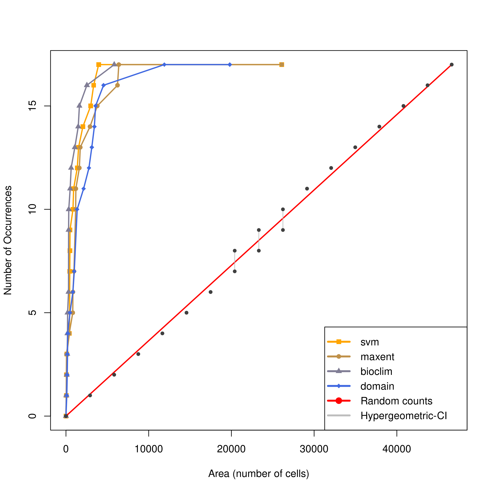

```{r Libraries, include=FALSE}
library(mapdata)
library(oz)
library(ggmap)
library(gridExtra)
library(terra)
library(raster)
library(leaflet)
library(dplyr)
library(sf)
library(rgdal)
library(sdm)
library(gbm)
library(tree)
library(mda)
library(class)
library(mgcv)
library(nlme)
library(glmnet)
library(Matrix)
library(earth)
library(Formula)
library(plotmo)
library(plotrix)
library(rJava)
library(RSNNS)
library(Rcpp)
library(ranger)
library(randomForest)
library(rpart)
library(kernlab)
library(dismo)
library(TeachingDemos)
char2seed('Charinus')
```

###### Andrea and Sara: I know you wanted something simple and small, but I've decided to catch up on some work I owed my co-advisor, and implement some things I had been playing around with. On top of that, I also really wanted to make it reproducible, and the scripts I had from my dissertation **were not**, so this was all pretty much from scratch. Also, this is in html and not pdf for two reasons: alternative text in the figures and the final plot, which doesn't work with pdf and I feel is the best way to explore ENM outputs in detail. 

```{r setup, include=FALSE}
knitr::opts_chunk$set(echo = TRUE)
```
# Charinus Ecological Niche Models
## Present to LGM projections

### **Overview**
##### This model is part of a population genetics study, led by Gustavo Silva de Miranda and collaborators. They aim to see if the following Ecological Niche Models fit the divergences found in their phylogenies.

#### **Taxon, Location, Predictors, Scale**
The focus taxon is a whip-spider (Arachnida:Amblypygi) clade of the genus *Charinus*. The genus has a pantropical distribution, while the focus clade occurs only in the Brazilian Atlantic Forest, in the Rio de Janeiro and Espírito Santo states.

### **Data**

#### Occurence Data
Occurrence data has been collected in the field using GPS devices by the lead author of the study, all coordinates have uncertainty <30m. The data consists of both presence (n = 23) and absence (n = 6) records. We divide this dataset into two (`R/01_Occ_to_shp.R`) in for training (17 presences) and testing (6 absences and 6 presences) and create shapefiles (`data/processed/shapefiles/`) to use in building and plotting the models. See the distribuition of occurrence data at the end of this script. Accessible area (M) [@barveCrucialRoleAccessible2011] was defined as the bounding box of a set of buffers of 200km diameter around occurrence records. All environmental layers were cropped by this limit (`R/02_Env-crop.R`).

##### Climatic Data
We use the 19 bioclimatic variables as model predictors [@hijmansVeryHighResolution2005]. We obtained [WorldClim](https://www.worldclim.org)'s bioclimatic variables on August 13th, 2022 for historic (mean of 1970-2000) data. We also obtained [PaleoClim](http://www.paleoclim.org)'s bioclimatic variables for the following time averages:

<center>
Period | Dates (kya)
-------------- | -------------
Late Holocene | 4.2 - 0.3
Mid Holocene  | 8.326 - 4.2
Early Holocene | 11.7 - 8.326
Younger Dryas Stadial | 12.9 - 11.7
Bølling-Allerød Period | 14.7 - 12.9
Heirich Stadial 1 | 17.0 - 14.7
Last Glacial Maximum | 130
</center>

At a 2.5min resolution (~5km at the equator), as there are no finer resolution scales available in the PaleoClim dataset. Variables retained after considering the taxon's biology, variable correlation are *Bio1*, *Bio4*, *Bio12* and *Bio15*. Bioclim was used in model build and test, and these models were then ensembled and projected onto PaleoClim's layers.

### **Model Fitting**
Models were built `R/03_Model-Build.R` using the aforementioned train and test data. We chose five algorithms to build them (SVM, MaxEnt, BRT, BioClim and Domain-dismo), with five bootstrap replicas each. All BRT models failed.

#### Model Outputs {.tabset}
<center>
##### MaxEnt Map output
```{r echo=FALSE, fig.cap= paste("Map output of MaxEnt model, as an example. From `04_Model-evaluation.R`"), fig.alt= paste("Map of suitability regions as defined by the MaxEnt algorithm. The map of the south eastern region of Brazil is in light gray, suitable areas are in a gradient from suitable to non suitable, black to light gray respectively. Occurrence records are depicted by red dots."), out.width="100%"}

```

 
##### MaxEnt Environmental output
```{r echo=FALSE, fig.cap= paste("Output of MaxEnt model, occurrence records and suitability regions in environmental space. From `04_Model-evaluation.R`"), fig.alt= paste("Twelve plots in a four by four grid, where the diagonal defines which environmental predictors are represented in the axes of the plots. Plots have a blue background and white dots represent all the regions in geographic space of our study area. Red dots represent the occurrence records. Suitable areas are defined by black dots, in a gradient going to unsuitable in shades of grey."), out.width="100%"}

```

##### Model output
```{r echo=TRUE, fig.height=4, fig.width=4}

model <- sdm::read.sdm('../data/processed/model-build/model-object/model.sdm')

model
```

</center>
### **Assessment**
#### Model Evaluation
We then evaluate these models by  with the accumulation of occurrences curve [@jimenezLeavingAreaReceiving2020] `R/04_Model-evaluation.R`, alongside the mean AUC score `05_AUC_values.R` (which is less problematic since we tested with absence data).

To run the [accum.occ](https://github.com/LauraJim/SDM-hyperTest/blob/master/Accum_curve_occ.R)() function, the sdm and the predict object had to be manipulated alongside the occurrence records and the environment used in prediction. We built two functions to prepare the data (`R/sdm_to_occ.pnts.R` & `R/sdm_to_output.mod.R`), regarding the two objects required by the AOcC function. The outputs of [accum.occ](https://github.com/LauraJim/SDM-hyperTest/blob/master/Accum_curve_occ.R)() and [comp.accplot](https://github.com/LauraJim/SDM-hyperTest/blob/master/compare_models.R)() are in `figs/aocc/`.

<center>
```{r, echo = FALSE, fig.cap = paste("Accumulation of occurrences curves comparing the performance of the four tested algorithms."), fig.alt = paste("A plot with the raster cells ranked from highest prediction to lowest in the x axis, and cummulative occurences in the y axis. Occurrences are marked where the algorithm predicted suitable area. There are four accumulation of occurrences, respective to each algorithm used in model build. There's a red line in the 1 to 1 diagonal that represents what a random model would find, with confidence intervals. The plot shows that the bioclim algorithm finds all occurrences in less cells than others, followed by max ent, then svm, and finally domain."), out.width="100%"}

```
</center>

We then selected the two best performing algorithms (SVM and MaxEnt) according to these two metrics to build a second round of models with 25 replicas for each algorithm `R/06_Final-Model.R`.

The evaluation of these final models (`R/07_Final-Model_Evaluation.R`) and their outputs and predictions are stored in `data/processed/final-model-build/`.

### **Predictions**
With the final models at hand, we projected them to the PaleoClim layers (`08/Predictions-Past.R`), and finally ensembled the two models, wheighing by the AUC values. The last step was binarizing the outputs of the ensembled projections by a 0.4 threshold (`09_Ensemble_Preds.R`). 

As a final step, we projected all layers along with the occurrence records on the following interactive map (`R/10_leaflet-map.R`):


```{r leaflet-requirements, include=FALSE}
## Occurrence Data #####
occ_train <- sf::read_sf('../data/processed/shapefiles/train.shp') # only presence data
shape_train <- st_transform(occ_train, CRS("+proj=longlat +datum=WGS84 +no_defs"))

occ_test <- sf::read_sf('../data/processed/shapefiles/test.shp') # presence/absence data
shape_test <- st_transform(occ_test, CRS("+proj=longlat +datum=WGS84 +no_defs"))

occ_raw <- sf::read_sf('../data/processed/shapefiles/raw.shp') # presence/absence data
shape_raw <- st_transform(occ_raw, CRS("+proj=longlat +datum=WGS84 +no_defs"))
## Ensembled Predictions #####
#### Present - Historical - 1970 - 2000
ens_pres <- sf::read_sf('../data/processed/final-model-build/ensemble-shapefiles/present-04threshold.shp') # only presence data
shape_pres <- st_transform(ens_pres, CRS("+proj=longlat +datum=WGS84 +no_defs"))
##### LH - Late Holocene - 4.2 - 0.3ky
ens_lh <- sf::read_sf('../data/processed/final-model-build/ensemble-shapefiles/lh-04threshold.shp') # only presence data
shape_lh <- st_transform(ens_lh, CRS("+proj=longlat +datum=WGS84 +no_defs"))
##### MH - Mid Holocene - 8.326 - 4.2ky
ens_mh <- sf::read_sf('../data/processed/final-model-build/ensemble-shapefiles/mh-04threshold.shp') # only presence data
shape_mh <- st_transform(ens_mh, CRS("+proj=longlat +datum=WGS84 +no_defs"))
##### EH - Early Holocene - 11.7 - 8.326ky
ens_eh <- sf::read_sf('../data/processed/final-model-build/ensemble-shapefiles/eh-04threshold.shp') # only presence data
shape_eh <- st_transform(ens_eh, CRS("+proj=longlat +datum=WGS84 +no_defs"))
##### YDS - Younger Dryas Stadial - 12.9 - 11.7ky
ens_yds <- sf::read_sf('../data/processed/final-model-build/ensemble-shapefiles/yds-04threshold.shp') # only presence data
shape_yds <- st_transform(ens_yds, CRS("+proj=longlat +datum=WGS84 +no_defs"))
##### BA -  Bølling-Allerød - 14.7 - 12.9ky
ens_ba <- sf::read_sf('../data/processed/final-model-build/ensemble-shapefiles/ba-04threshold.shp') # only presence data
shape_ba <- st_transform(ens_ba, CRS("+proj=longlat +datum=WGS84 +no_defs"))
##### HS1 - Heirich Stadial 1 - 17.0 - 14.7ky
ens_hs1 <- sf::read_sf('../data/processed/final-model-build/ensemble-shapefiles/hs1-04threshold.shp') # only presence data
shape_hs1 <- st_transform(ens_hs1, CRS("+proj=longlat +datum=WGS84 +no_defs"))
##### LGM - Last Glacial Maximum - 130ky
ens_lgm <- sf::read_sf('../data/processed/final-model-build/ensemble-shapefiles/lgm-04threshold.shp') # only presence data
shape_lgm <- st_transform(ens_lgm, CRS("+proj=longlat +datum=WGS84 +no_defs"))


# Get the map ####
centroid_lon <- round(coordinates(as(extent(shape_pres), "SpatialPolygons"))[1],digits = 2) # get the longitude of centroid of pred object
centroid_lat <- round(coordinates(as(extent(shape_pres), "SpatialPolygons"))[2],digits = 2) # get the latitude of centroid of pred object
```
<center>
```{r leaflet, echo=FALSE}
leaflet() %>% 
  addTiles() %>% 
  setView( lng = centroid_lon, lat = centroid_lat, zoom = 6) %>% 
  addProviderTiles("Esri.WorldImagery") %>%
  addPolygons(data = shape_pres,
              label = 'Present Suitable Area',
              color = "white", 
              weight = 0.75, 
              smoothFactor = 0.5,
              opacity = 1.0, 
              fillColor = "#fde725",
              fillOpacity = 0.7,
              highlightOptions = highlightOptions(color = "white", weight = 2,
                                                  bringToFront = TRUE),
              group = "Present - Historical - 1970 - 2000") %>%
  addPolygons(data = shape_lh,
              label = 'Late Holocene Suitable Area (4.2 - 0.3ky)',
              color = "white", 
              weight = 0.75, 
              smoothFactor = 0.5,
              opacity = 1.0, 
              fillColor = "#a0da39",
              fillOpacity = 0.7,
              highlightOptions = highlightOptions(color = "white", weight = 2,
                                                  bringToFront = TRUE),
              group = "Late Holocene - 4.2 - 0.3ky") %>%
  addPolygons(data = shape_mh,
              label = 'Mid Holocene Suitable Area (8.326 - 4.2ky)',
              color = "white", 
              weight = 0.75, 
              smoothFactor = 0.5,
              opacity = 1.0, 
              fillColor = "#4ac16d",
              fillOpacity = 0.7,
              highlightOptions = highlightOptions(color = "white", weight = 2,
                                                  bringToFront = TRUE),
              group = "Mid Holocene - 8.326 - 4.2ky") %>%
  addPolygons(data = shape_eh,
              label = 'Early Holocene Suitable Area (11.7 - 8.326ky)',
              color = "white", 
              weight = 0.75, 
              smoothFactor = 0.5,
              opacity = 1.0, 
              fillColor = "#1fa187",
              fillOpacity = 0.7,
              highlightOptions = highlightOptions(color = "white", weight = 2,
                                                  bringToFront = TRUE),
              group = "Early Holocene - 11.7 - 8.326ky") %>%
  addPolygons(data = shape_yds,
              label = 'Younger Dryas Stadial Suitable Area (12.9 - 11.7ky)',
              color = "white", 
              weight = 0.75, 
              smoothFactor = 0.5,
              opacity = 1.0, 
              fillColor = "#277f8e",
              fillOpacity = 0.7,
              highlightOptions = highlightOptions(color = "white", weight = 2,
                                                  bringToFront = TRUE),
              group = "Younger Dryas Stadial - 12.9 - 11.7ky") %>%  
  addPolygons(data = shape_ba,
              label = 'Bølling-Allerød Suitable Area (14.7 - 12.9ky)',
              color = "white", 
              weight = 0.75, 
              smoothFactor = 0.5,
              opacity = 1.0, 
              fillColor = "#365c8d",
              fillOpacity = 0.7,
              highlightOptions = highlightOptions(color = "white", weight = 2,
                                                  bringToFront = TRUE),
              group = "Bølling-Allerød - 14.7 - 12.9ky") %>%  
  addPolygons(data = shape_hs1,
              label = 'Heirich Stadial 1 Suitable Area (17.0 - 14.7ky)',
              color = "white", 
              weight = 0.75, 
              smoothFactor = 0.5,
              opacity = 1.0, 
              fillColor = "#46327e",
              fillOpacity = 0.7,
              highlightOptions = highlightOptions(color = "white", weight = 2,
                                                  bringToFront = TRUE),
              group = "Heirich Stadial 1 - 17.0 - 14.7ky") %>%  
  addPolygons(data = shape_lgm,
              label = 'Last Glacial Maximum Suitable Area (130ky)',
              color = "white", 
              weight = 0.75, 
              smoothFactor = 0.5,
              opacity = 1.0, 
              fillColor = "#440154",
              highlightOptions = highlightOptions(color = "white", weight = 2,
                                                  bringToFront = TRUE),
              group = "Last Glacial Maximum - 130ky") %>%  
  addCircleMarkers(data = shape_train, 
                   label = 'Presence Train Data', 
                   fillColor = '#f0f921',
                   fillOpacity = 1,
                   stroke = T, color = 'white', weight = 2,
                   group = "Train Data - Presence") %>%
  addCircleMarkers(data = shape_test, 
                   label = c('Presence Test Data', 'Absence Test Data'), 
                   fillColor = c('#f89540','#cc4778'),
                   fillOpacity = 1,
                   stroke = T, color = 'white', weight = 2,
                   group = "Test Data Presence/Absence")  %>%  
  addCircleMarkers(data = shape_train, 
                   label = 'Presence Train Data', 
                   fillColor = c('#7e03a8'),
                   fillOpacity = 1,
                   stroke = T, color = 'white', weight = 2,
                   group = "Train Data - Presence") %>%
  addCircleMarkers(data = shape_raw, 
                   label = c('Presence Raw Data', 'Absence Raw Data'), 
                   fillColor = c('#6497b1','#b3cde0'),
                   fillOpacity = 1,
                   stroke = T, color = 'white', weight = 2,
                   group = "Raw Data Presence/Absence") %>%
  addLayersControl(overlayGroups = c("Present - Historical - 1970 - 2000", 
                                     "Late Holocene - 4.2 - 0.3ky",
                                     "Mid Holocene - 8.326 - 4.2ky",
                                     "Early Holocene - 11.7 - 8.326ky",
                                     "Younger Dryas Stadial - 12.9 - 11.7ky",
                                     "Bølling-Allerød - 14.7 - 12.9ky",
                                     "Heirich Stadial 1 - 17.0 - 14.7ky",
                                     "Last Glacial Maximum - 130ky"),
                   baseGroups = c("Train Data - Presence",
                                  "Test Data Presence/Absence",
                                  'Raw Data Presence/Absence',
                                  'None'),
                   options = layersControlOptions(collapsed = T)) %>%
  htmlwidgets::onRender("
        function() {
            $('.leaflet-control-layers-overlays').prepend('<label style=\"text-align:center\">Charinus Suitable Area</label>');
            $('.leaflet-control-layers-base').prepend('<label style=\"text-align:center\">Charinus Occurrences</label>');
        }
    ")
```
Interactive map of ensembled presence/absence predictions. (Only works in the html version of this document)
</center>
#### **References**